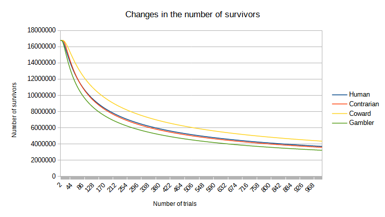
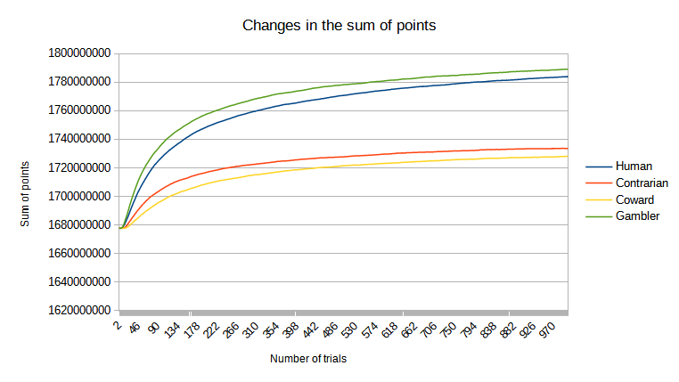
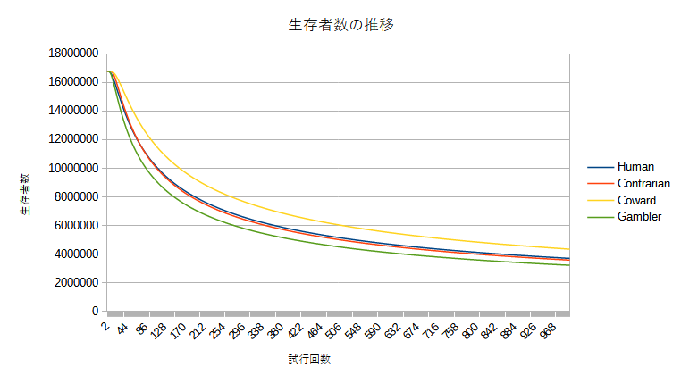
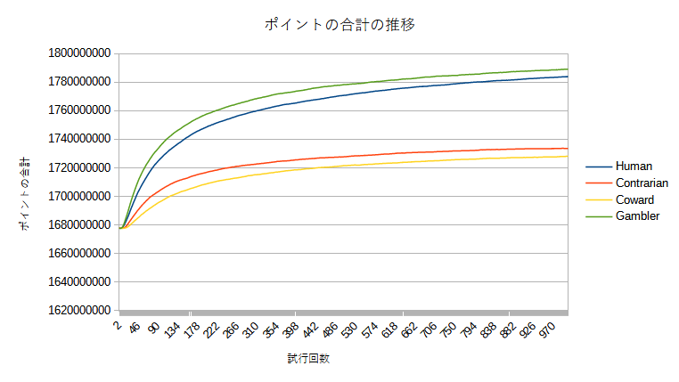

# Introduction

Do you know "Loss Aversion([Prospect Theory](https://en.wikipedia.org/wiki/Prospect_theory))” ?

For example, if you have the following options:

1. Option A: Unconditionally get $ 10,000.
1. Option B: Toss a coin and get $ 20,000 when the front comes out, but nothing when the back comes out.

The two have the same expected amount of $ 10,000, but most people (and probably you too) choose to get $ 10,000
unconditionally.
On the other hand, suppose you are asked the following question.

1. Option A: Unconditionally reduce the debt by $ 10,000 and the total debt is $ 10,000.
1. Option B: Toss a coin, and if the front side appears, the entire debt is exempted, but if the back side appears, the
   total debt amount does not change.

Again, the expected value is minus $ 10,000, which is still **the same**. But most people choose the second gambling
option, unlike the last time.
In this way, there is a paradox that people try to secure profits but avoid losses even if it's just the luck of the
draw. This is **Loss Aversion**.
Wikipedia explains this reason with the model that "the magnitude of value is not proportional to the amount of money".
Even if the amount is doubled, the value is only about 1.6 times, so a certain $ 10,000 is larger than the 50%
probability of $ 20,000.

However, I thought, "In fact, it may be a rational choice to try to avoid the loss even if it's just the luck of the
draw." and examined the hypothesis by computer simulation.

# Simulation

1. First, prepare agents who choose an option according to the "Loss Aversion" like a human being, agents who choose an
   option according to the opposite law, and agents who always choose a fixed points option, always choose a
   probabilistic points option as a control group. Create 2^24(16,777,216) agents at a time.
    1. Each agent initially has "100 points".
1. Then, ask each agent randomly selected one of the two choice pairs, and increase or decrease the "points"
   from the answer. Repeat this 1000 times.
    1. Agents with "points" below zero will "die" and will no longer be able to earn points.
1. Record changes in the number of "survivors" and sum of "points" of each kind of agents.

When applied to the real world, 2-i's "die" means "once starved to death, no matter how much food is given, it will not
come back to life" and "once the funds are zero, it will not be possible to participate in the market after that". This
is the reason why I thought, "it may be a rational choice to try to avoid the loss even if it's just the luck of the
draw." Once you "die", you have no chance anymore, so I thought it would be rational to try to avoid the loss.

"Question" and "Questioner" are implemented in the question package, and the agent is implemented in the agent package.
The simulation is done in the Main class. The result is output to survivor_num.tsv and points_sum.tsv files. Note that
graph_generation_sample.ods is a sample to generate a graph of the results.

# Result

- Human:choose an option according to the "Loss Aversion" like a human being
- Contrarian:choose an option according to the opposite law of Human
- Coward:always choose a fixed points option
- Gambler:always choose a probabilistic points option
  
  
  Human lost to the Coward strategy in terms of survival rate and lost to Gambler in sum of points. However,
  considering both "survival rate" and "sum of points", it can be interpreted that Human(Loss Aversion), which has
  achieved good results in both places, is the best strategy when viewed comprehensively. In fact,
  Coward, which is the top in "survival rate", is the lowest in "sum of points". In addition, Gambler took the top by a
  small margin in "sum of points", but was the lowest in "survival rate".

-------------------------------------------------------------------------------------------------------------------------------

# はじめに

「損失回避の法則（[プロスペクト理論](https://ja.wikipedia.org/wiki/%E3%83%97%E3%83%AD%E3%82%B9%E3%83%9A%E3%82%AF%E3%83%88%E7%90%86%E8%AB%96)
）」というのをご存じですか？

例えば以下のような選択肢があったとします。

1. 選択肢A:100万円が無条件で手に入る。
1. 選択肢B:コインを投げ、表が出たら200万円が手に入るが、裏が出たら何も手に入らない。

この二つは手に入る金額の期待値は同じ100万円ですが、ほとんどの人は（おそらくあなたも）100万円が無条件で手に入る方を選びます。
一方で以下のような質問をされたとします。

1. 選択肢A:無条件で借金が100万円減額され、借金総額が100万円となる。
1. 選択肢B:コインを投げ、表が出たら借金が全額免除されるが、裏が出たら借金総額は変わらない。

この場合も期待値が-100万円で **同じ** であることは変わりません。しかしほとんどの人は前回と打って変わって2番目のギャンブル性のある選択肢を選びます。
このように人は利益は確定させようとするのに損失は運任せにしてでも回避しようとするというパラドックスがあります。これが **損失回避の法則** です。
Wikipediaではこの理由について「価値の大きさは金額と比例関係にない」というモデルで説明しています。金額が2倍になっても価値は1.6倍程度にしかならないため確実な100万円の方が50％の確率の200万円より大きくなるというわけです。

ただ自分は「実は損失を運任せでも回避しようとするのは合理的な選択なのではないか」と考えその仮説をこのコンピュータ・シミュレーションで検討してみることにしました。

# シミュレーション

1. まず、人間と同じように「損失回避の法則」に従って選択肢を選ぶエージェント、反対の法則に従って選択肢を選ぶエージェント、そして対照群として常に確定的な選択肢を選ぶエージェント、常に確率的な選択肢を選ぶエージェントを2^24(
   16,777,216)体ずつ作ります。
    1. 各エージェントは最初「100ポイント」を持ってます。
1. そして各エージェントに対して2種類の選択肢のペアのどちらかをランダムに選び質問し、回答から「ポイント」の増減を行います。これを1000回繰り返します。
    1. 「ポイント」がゼロ以下になったエージェントは「死亡」し、以降ポイントを得ることはできません。
1. 各種エージェントの「生存者」数と「ポイント」の合計の推移を記録します。

2-1の「死亡」は現実世界に当てはめると「一度餓死するとその後いくら食料を与えても生き返らない」「一度資金がゼロになるとそれ以降市場に参加できない」といったことを意味します。これが自分が「実は損失を運任せでも回避しようとするのは合理的な選択なのではないか」と考えた理由です。一度「死亡」してしまえばもうチャンスはなくなってしまうのだから運任せでも損失を回避しようとするのが合理的ではないかと考えました。

questionパッケージに「質問」と「質問者」を、agentパッケージにエージェントを実装しています。
シミュレーションはMainクラスで行っています。「生存者」数の推移はsurvivor_num.tsv、「ポイント」の合計の推移はpoints_sum.tsvに出力されます。また、graphe_generation_sample.odsは結果のグラフ化のサンプルです。

# 結果

- Human(人間):「損失回避の法則」に従って選択肢を選ぶ
- Contrarian(逆張り):人間と反対の法則で選択肢を選ぶ
- Coward(臆病):常に確定ポイントの選択肢を選ぶ
- Gambler(ギャンブラー):常に運任せの選択肢を選ぶ
  
  

Humanは（少しの差ですが）生存率ではCoward戦略に負けポイント数の合計ではGamblerに負けるという結果が出ました。ただ「生存率」と「ポイントの合計」両方を考慮するとどちらでも2位で良い成績を出しているHuman（損失回避の法則）が総合的に見ると最も良い戦略である、と解釈することも可能かもしれません。実際、「生存率」ではトップのCowardは「ポイントの合計」ではGambler、Humanに大きく水をあけられ最下位です。また、Gamblerは「ポイントの合計」では僅差でトップを取りましたが「生存率」では最下位です。
